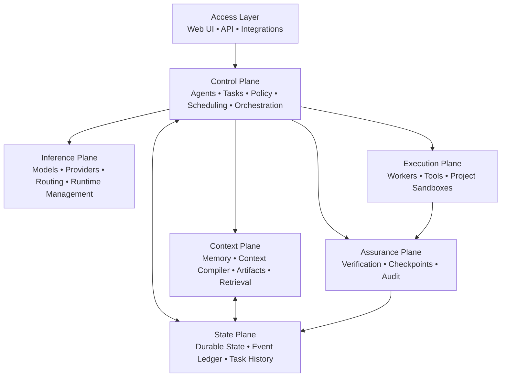

# OnePane

**Local-first AI orchestration, agents, projects, tools, and automation — from one pane of glass.**

OnePane is a self-hosted AI harness for building, running, and supervising persistent AI agents and autonomous workloads.

It brings models, agents, tools, memory, sandboxed projects, scheduled tasks, verification, and human oversight into a single platform — without requiring users to assemble and maintain a collection of disconnected AI services.

> **The harness owns state, memory, policy, budgets, authority, and the execution loop. Models perform bounded reasoning jobs.**

---

## Why OnePane?

Most AI agent systems place too much responsibility inside the model.

The model is expected to remember state, decide what it is allowed to do, manage tools, recover from failures, determine whether work actually succeeded, and somehow maintain continuity between sessions.

OnePane takes a different approach.

Models are treated as interchangeable reasoning engines. The harness remains authoritative.

This means an agent can survive:

- model changes
- provider changes
- context resets
- process restarts
- worker failures
- UI sessions ending
- local-to-cloud escalation

The goal is durable AI infrastructure rather than another chat interface.

---

## Core Principles

### Local-first, not local-only

OnePane is designed to run on your own hardware first.

Local models can handle routing, classification, lightweight reasoning, embeddings, background tasks, and other workloads without requiring a cloud provider.

When a task requires additional capability, OnePane can route work to larger local models or approved cloud providers.

---

### Agents are persistent. Models are replaceable.

An agent is not a model process.

Agents have durable identity, state, permissions, memory, task history, tools, policies, and working context.

Models are compute resources that agents can use.

Changing from one model to another should not mean losing the agent.

---

### The harness is authoritative

Models propose actions.

OnePane decides whether those actions are permitted, executes them through controlled interfaces, records the resulting observations, verifies outcomes, and determines what happens next.

A model claiming that something succeeded does not make it true.

---

### Verified completion

OnePane distinguishes between a model finishing its response and work actually being complete.

The execution lifecycle is designed around:

```text
Intent
  ↓
Authorization
  ↓
Execution
  ↓
Observation
  ↓
Verification
  ↓
Commit
```

Tasks should only reach a completed state once their required outcome has been independently verified.

---

### Sandboxed by default

Projects and autonomous workloads should not receive unrestricted access to the host system.

OnePane is being designed around isolated project environments, capability-based tool access, explicit permissions, and narrowly scoped privileged operations.

---

## What OnePane Will Provide

### Persistent AI Agents

Create agents that maintain identity and state independently of whichever model happens to be serving them.

Agents can be given:

- roles
- instructions
- permissions
- tools
- memory
- model preferences
- budgets
- project access
- scheduled responsibilities

---

### Hardware-Aware Model Setup

OnePane aims to remove the usual friction involved in setting up local AI.

During setup, OnePane will be able to inspect available hardware such as:

- CPU
- system memory
- GPU
- VRAM
- drivers
- storage

It can then recommend models suited to the machine, download them, configure an appropriate inference runtime, and register them with OnePane.

The goal is:

```text
Install OnePane
      ↓
Detect Hardware
      ↓
Recommend Models
      ↓
Download & Configure
      ↓
Start Using AI
```

No separate model-management stack should be required just to get started.

---

## Sandboxed Project Workspaces

OnePane projects are intended to be more than folders containing AI conversations.

Each project can have its own isolated execution environment where humans and agents work on the same project.

A project workspace may contain:

- source code
- repositories
- databases
- dependencies
- installed applications
- development tools
- generated artifacts
- task history
- agent state
- runtime configuration

Agents can build and modify applications inside the project sandbox while changes are visible to the user through the OnePane interface.

The longer-term goal is to allow software to move naturally from:

```text
Idea
  ↓
Agent + Human Development
  ↓
Sandboxed Runtime
  ↓
Review
  ↓
Deployment
  ↓
Scheduled / Autonomous Operation
```

without leaving OnePane.

---

## Automation and Scheduled Work

OnePane is intended to support both interactive and autonomous workloads.

Projects and agents will be able to run recurring or scheduled tasks such as:

- reports
- monitoring
- data processing
- repository maintenance
- infrastructure checks
- research
- backups
- application workflows
- agent routines

Scheduled work uses the same permission, sandboxing, verification, logging, and model-routing systems as interactive work.

---

## Controlled Tool Execution

Tools are not called directly because a model emitted a tool-shaped response.

OnePane mediates access through a controlled Tool Gateway.

The intended execution pattern is:

```text
Agent
  ↓
Tool Intent
  ↓
Policy Evaluation
  ↓
Capability Authorization
  ↓
Tool Gateway
  ↓
Execution
  ↓
Observation
  ↓
Verification
```

Sensitive capabilities can be constrained by scope, duration, project, agent, action, and resource.

---

## Model Routing

Different jobs require different levels of intelligence.

OnePane is designed to use small and efficient models where possible and reserve expensive models for work that actually requires them.

For example:

```text
Fast Local Classifier
        ↓
Deterministic Orchestrator
        ↓
Selected Worker Model
        ↓
Tool / Environment
        ↓
Observation
        ↓
Verifier / Judge
        ↓
NEXT
RETRY
REPLAN
ESCALATE
HUMAN
DONE
FAIL
```

Models may be local or remote, but routing decisions remain part of the harness.

---

## Architecture

OnePane is being designed around several cooperating planes with clearly separated responsibilities.



### Control Plane

Owns orchestration and decision-making around:

- agents
- tasks
- attempts
- scheduling
- permissions
- budgets
- policy
- worker lifecycle

### State Plane

Stores durable system truth including:

- agent state
- task state
- attempts
- observations
- events
- checkpoints
- artifacts
- configuration

### Context Plane

Determines what information a model receives.

Rather than simply replaying conversation history, OnePane can construct bounded context based on the current task, agent, project, memory, artifacts, and available token budget.

### Inference Plane

Provides a common abstraction over model execution.

This includes:

- local models
- remote providers
- model discovery
- model capabilities
- runtime configuration
- routing
- health
- context limits
- cost and resource awareness

### Execution Plane

Runs actual work.

This includes:

- ephemeral workers
- project environments
- containers
- tools
- commands
- application runtimes

### Assurance Plane

Determines whether work actually achieved its intended outcome.

It provides:

- verification
- checkpoints
- validation
- auditability
- failure detection
- human approval boundaries

---

## Technology Direction

The current backend architecture is centred around a Go service called `harnessd`.

The initial platform direction includes:

```text
Go
├── REST / SSE API
├── Durable task engine
├── Agent runtime
├── Policy engine
├── Context compiler
├── Model registry
├── Provider connections
├── Tool gateway
├── Verification engine
├── Scheduler
└── Project runtime

SQLite
└── Durable state + event ledger

Containers
└── Rootless Podman / Docker project isolation
```

The architecture is intentionally starting as a modular monolith.

The priority is strong internal boundaries and reliable behaviour before introducing unnecessary distributed-system complexity.

---

## Current Status

> **OnePane is under active development and is not yet ready for production use.**

The current work is focused on the core harness and durable execution model.

Major foundations include:

- durable task and attempt state
- event-based execution history
- deterministic orchestration
- policy and capability boundaries
- tools and observations
- artifacts
- verification and checkpoint semantics
- inference/model abstractions
- sandboxed execution architecture

Work is continuing toward an installable self-hosted alpha.

---

## Roadmap

Near-term development is focused on:

1. Model and inference runtime management
2. Hardware discovery and model recommendations
3. Local model installation and lifecycle management
4. Agent runtime and orchestration
5. Context compilation and memory
6. Sandboxed project workspaces
7. Human + agent collaborative project UI
8. Scheduled and autonomous workloads
9. Tool and capability management
10. Verification and approval workflows
11. Observability and audit interfaces
12. Single-command installation
13. Backup, recovery, and migration
14. Multi-node execution

---

## Installation

Installation documentation will be published once the initial installer and runtime configuration are stable.

The intended experience is eventually:

```bash
curl -fsSL <installer> | sh
```

followed by browser-based setup for:

```text
Host Detection
      ↓
Storage
      ↓
Sandbox Runtime
      ↓
Inference
      ↓
Models
      ↓
First Agent
      ↓
Ready
```

OnePane should be useful immediately after installation without requiring users to manually assemble a separate AI software stack.

---

## Project Goals

OnePane is ultimately intended to provide one self-hosted environment for:

**Agents · Models · Projects · Tools · Memory · Automation · Applications · Verification**

One pane of glass for your AI infrastructure.

---

## Development

OnePane is currently developed by **DigiLogicTech**.

The repository is presently in private development while the architecture, runtime, installation process, and initial user experience are stabilised.

Contribution guidelines and public development documentation will be added as the project approaches its first public release.

---

## License

OnePane is open-source software developed by **DigiLogicTech**.

OnePane is licensed under the **Apache License 2.0**.

You are free to use, modify, distribute, and build upon OnePane in accordance with the terms of the license.

See [`LICENSE`](LICENSE) for the full license text.

Copyright © DigiLogicTech.
