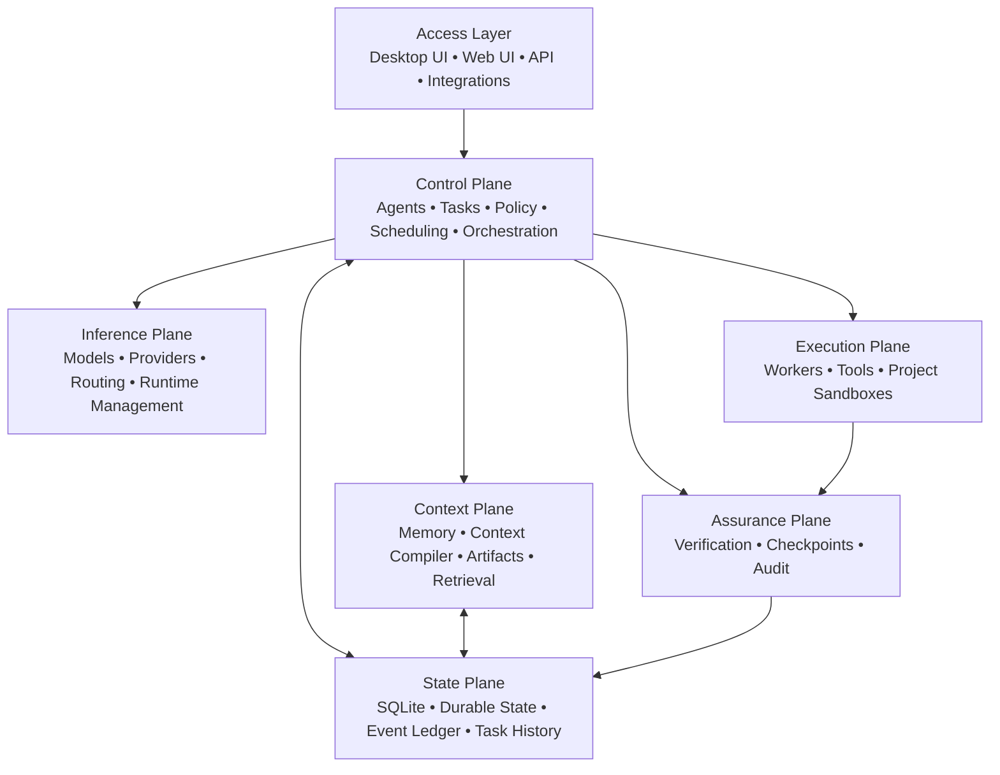

# OnePane

**Local-first AI control plane for persistent agents, models, tools, projects, automation, and verified execution.**

OnePane is an open-source, self-hosted AI harness developed by **DigiLogic**. The GitHub organization is **DigiLogicTech**.

The core design principle is simple:

> **The harness owns state, policy, execution, verification, and continuity. Models are bounded, replaceable reasoning workers.**

OnePane is intended to let long-running work survive model swaps, runtime changes, provider changes, worker failures, process restarts, and local-to-remote escalation without losing the task itself.

---

## Status

> **OnePane is alpha software and is not yet recommended for production use.**

Current development is focused on the **Alpha 2** line, including the Windows native application/installer, Ubuntu headless reference deployment, managed local-AI runtimes, distributed inference, project sandboxes, and the updated control-plane UI.

The active integration branch is:

```text
alpha2-integration
```

Old alpha installers should be treated as test builds only. Alpha 2 packaging is being rebuilt with explicit repair/upgrade handling before a new Windows installer is published.

---

## What OnePane Is

OnePane is not designed as a model process with tools bolted onto it.

It is a durable control plane around models.

```text
User / Automation / API
          ↓
      OnePane
          ↓
Classifier / Router
          ↓
Swarm / Task Orchestrator
          ↓
Agents + Tools + Sandboxes
          ↓
Observation / Verification
          ↓
NEXT · RETRY · REPLAN · ESCALATE · HUMAN · DONE
```

The harness remains authoritative throughout the lifecycle.

A model can propose work. OnePane decides whether that work is permitted, executes it through controlled interfaces, records the result, verifies the outcome, checkpoints state, and decides what happens next.

---

## Core Capabilities

### Persistent tasks and agents

Tasks and agents are independent of the model process serving them.

OnePane is designed to preserve:

- task state
- conversation and working context
- tool state
- artifacts
- remaining plan
- routing metadata
- execution state
- checkpoints
- budgets and policy state

This makes model and runtime replacement a control-plane operation rather than a task-ending event.

### Managed Hot Swap

Managed Hot Swap is a built-in OnePane capability.

It can checkpoint a task, drain the current inference path, move execution to another compatible model/runtime/node/provider, restore task context, and continue.

Hot Swap is runtime-agnostic and remains available whether Colibri or OmniRoute are enabled or disabled.

### Colibri

OnePane Alpha 2 integrates **Colibri** as a managed inference runtime for larger or resource-constrained models.

The intended runtime targets include:

```text
local/native
local/colibri
node/native
node/colibri
cloud/provider
```

Colibri can use local compute or qualified OnePane nodes. Remote nodes are expected to be explicitly enrolled, authenticated, capability-advertised, health-checked, and policy-qualified before receiving workloads.

### OmniRoute

OnePane Alpha 2 integrates **OmniRoute** as a managed routing component for advanced model/provider routing.

Provider credentials remain brokered by OnePane rather than being exposed broadly to project sandboxes or model workers.

### Sandboxed projects

Projects are isolated working environments, not just folders of chat history.

A project can contain:

- source code
- repositories
- databases
- dependencies
- generated artifacts
- task history
- agent state
- project configuration
- sandbox policy

Project sandbox policy is intentionally separate from OnePane's own managed-component runtime policy.

### Verification-first execution

A model saying that work succeeded is not enough.

OnePane's execution model separates intent, execution, observation, and verification:

```text
Intent
  ↓
Authorization
  ↓
Execution
  ↓
Observation
  ↓
Verification
  ↓
Commit
```

Tasks should reach a completed state only when their required outcome has been verified.

### Hardware-aware local AI

OnePane is being built to understand the machine it is running on, including:

- CPU
- system memory
- GPU
- VRAM
- drivers
- storage
- model compatibility
- context requirements
- current load

That information can be used for model recommendations, runtime qualification, routing, and distributed-node scheduling.

---

## Managed Components

OnePane's Alpha 2 packaging model treats local-AI dependencies as **OnePane-managed components**, not global host installations.

The Windows installer is being built to provision the required component payloads without separate Colibri or OmniRoute confirmation screens.

Runtime control belongs inside OnePane:

```text
Settings
└── Local AI
    └── Components
        ├── Colibri
        │   ├── Enable
        │   ├── Disable
        │   └── Remove / Reinstall
        └── OmniRoute
            ├── Enable
            ├── Disable
            └── Remove / Reinstall
```

Optional component failure must not make the core `harnessd` service unhealthy.

---

## Settings and Policy Scope

OnePane separates configuration by scope:

```text
Global application settings
          ↓
Project settings
          ↓
Workspace settings
          ↓
Sandbox policy
```

Global settings provide application-wide defaults and preferences. They are not intended to silently override project, workspace, or sandbox policy.

Alpha 2 UI work also includes:

- improved light/dark themes
- two-tone and gradient themes
- installable theme packs
- language support and language packs
- core skills
- Local AI controls
- model specification views
- Agent Check / Testbed workflows
- Operations Inspector flows
- phone-native responsive layouts

---

## Architecture

OnePane currently centres on a Go service named `harnessd` with SQLite-backed durable state.



The architecture deliberately starts as a modular monolith. Strong internal boundaries and deterministic behaviour take priority over introducing distributed-system complexity prematurely.

---

## Platform Direction

### Windows

Windows is intended to provide a native desktop application backed by the OnePane service.

The Alpha 2 installer is being rebuilt around:

```text
Preflight
   ↓
Installation / Data Location
   ↓
Model Pool Location
   ↓
Install / Repair OnePane
   ↓
Start + Health Check
   ↓
Launch OnePane
   ↓
First-run Tour
```

The **Model Pool Location** remains an explicit choice because model storage can be large and expensive to relocate.

### Linux / Ubuntu

Ubuntu is the headless reference deployment for server and node workloads.

### macOS

macOS packaging is planned after the Alpha 2 Windows and Ubuntu paths are stabilised.

---

## Distributed Inference

OnePane's node model is intended to allow larger models to run elsewhere without transferring task ownership away from the harness.

A node may advertise capabilities such as:

- available models
- CPU / RAM
- GPU / VRAM
- runtime support
- context limits
- health
- current load

OnePane can then choose a qualified execution target based on compatibility, availability, latency, resource requirements, cost, privacy policy, and project routing restrictions.

A remote-node failure should trigger quarantine/fallback logic rather than automatically destroying the task.

---

## Technology

Current implementation direction includes:

```text
Go
├── harnessd
├── REST / streaming APIs
├── durable task engine
├── agent runtime
├── policy engine
├── context compiler
├── model registry
├── provider connections
├── tool gateway
├── verification engine
├── scheduler
└── project runtime

SQLite
└── durable state + event ledger

Windows
├── native desktop shell
├── service wrapper
└── installer / repair path

Sandbox runtimes
└── isolated project and managed-component execution
```

---

## Installation

A stable public Alpha 2 installer will be published only after the current clean-install, repair/upgrade, service-health, component-isolation, and packaging checks pass.

Until then, builds in this repository should be treated as development artifacts.

---

## Development Priorities

Current priorities include:

1. Authoritative Alpha 2 source promotion and CI
2. Windows clean-install and broken-alpha repair validation
3. Managed component provisioning and supervision
4. Runtime-agnostic Hot Swap
5. Distributed Colibri node scheduling
6. Model routing and provider integration
7. Project sandbox isolation
8. Durable task/checkpoint semantics
9. Verification and assurance
10. Windows and Ubuntu packaging parity
11. macOS packaging
12. Release, migration, backup, and recovery workflows

---

## Project Goals

OnePane is intended to provide one self-hosted environment for:

**Agents · Models · Projects · Tools · Memory · Automation · Applications · Verification**

One pane of glass for AI infrastructure.

---

## Development

OnePane is developed by **DigiLogic**.

Repository and project infrastructure are hosted under the **DigiLogicTech** GitHub account.

The project is under active development. APIs, data formats, installation behaviour, and runtime interfaces may change between alpha builds.

---

## License

OnePane is licensed under the **Apache License 2.0**.

See [`LICENSE`](LICENSE) for the license terms and [`NOTICE`](NOTICE) for project attribution.

Copyright 2026 John Spencer Jr trading as DigiLogic.
