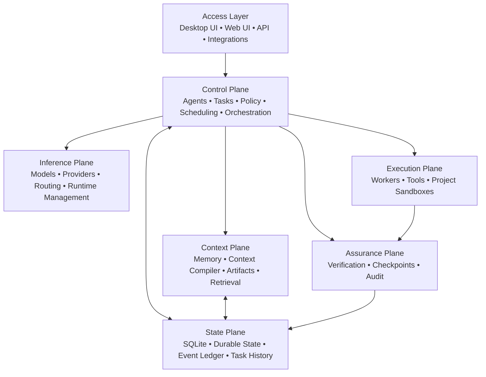

# OnePane

**A local-first AI control plane for persistent agents, models, tools, projects, automation, and verified execution.**

OnePane is an open-source, self-hosted AI harness developed by **DigiLogic** and hosted under **DigiLogicTech**.

Its central design principle is:

> **The harness owns state, policy, execution, verification, and continuity. Models are bounded, replaceable reasoning workers.**

That distinction shapes the entire product. OnePane is designed so a task can survive model swaps, runtime changes, provider changes, node failures, process restarts, and local-to-remote escalation without making the model itself the source of truth.

---

## Status

> **OnePane is Alpha software and is not yet recommended for production use.**

Current development is focused on the **Alpha 2** line.

The active integration branch is:

```text
alpha2-integration
```

Alpha 2 currently targets:

| Platform | Target | Package model |
|---|---|---|
| Windows | x64 | Native desktop application + installer |
| Ubuntu | amd64 | Headless `.deb` |
| Ubuntu | arm64 | Headless `.deb` |
| macOS | Universal | Native application + DMG |

Ubuntu Alpha 2 packages are already being produced through CI. Windows and macOS packaging use the same commit-bound build pipeline and are being validated as part of the Alpha 2 release process.

Broader platform support — including Windows ARM64, RPM-based Linux distributions, generic Linux tarballs, OCI/container releases, mobile clients, and other operating systems — is intentionally deferred until the **Beta** phase.

The current priority is to make OnePane a dependable product on a small number of platforms before increasing the support surface.

---

## What OnePane Is

OnePane is not a model process with a tool loop wrapped around it.

It is a durable control plane around models.

```text
User / Automation / API
          ↓
      OnePane
          ↓
Classifier / Router
          ↓
Task / Swarm Orchestrator
          ↓
Agents + Tools + Sandboxes
          ↓
Observation / Verification
          ↓
NEXT · RETRY · REPLAN · ESCALATE · HUMAN · DONE
```

The harness remains authoritative throughout the lifecycle.

A model can reason, propose actions, call approved capabilities, or produce candidate results. OnePane owns the durable task, permissions, execution state, observations, checkpoints, routing, verification, and final lifecycle decision.

---

## Why OnePane Is Different

Many agent frameworks are primarily organised around a model session: the model receives context, chooses tools, emits actions, and is expected to keep enough state in its context window to continue the job.

OnePane takes the opposite approach.

### The task survives the model

An agent or task is not the model process serving it.

Models can be replaced without replacing the task. OnePane keeps durable state outside the model so work can continue across:

- model changes
- runtime changes
- local-to-remote movement
- cloud escalation
- worker failure
- process restart
- context reconstruction
- node loss

### The harness, not the model, is authoritative

Models do not decide whether an operation truly succeeded.

OnePane separates:

```text
Intent
  ↓
Authorization
  ↓
Execution
  ↓
Observation
  ↓
Verification
  ↓
Commit
```

A model claiming that something completed does not automatically move the task to `DONE`.

### Routing is part of the control plane

OnePane treats inference as a schedulable resource.

The control plane can reason about:

- model compatibility
- local vs remote execution
- available RAM / VRAM
- runtime support
- context requirements
- node health
- current load
- provider availability
- cost
- privacy and project policy

The model does not own the routing decision.

### Local-first does not mean local-only

OnePane is designed to prefer self-hosted execution where appropriate while still supporting larger local models, enrolled remote nodes, and approved hosted providers.

The same durable task can move between execution targets without changing task ownership.

### Sandboxes are policy boundaries

Project sandboxes are separate from OnePane's own managed-component environment.

This prevents local AI runtimes and provider-routing components from implicitly inheriting project permissions, while also preventing project workloads from receiving broad host access.

### Components are managed by OnePane

Colibri and OmniRoute are managed as OnePane components rather than global host installations.

That gives OnePane control over component lifecycle, health, permissions, data paths, enable/disable state, recovery, and future upgrades.

An optional component becoming unhealthy must not make the core OnePane harness unhealthy.

---

# Alpha 2 Feature Set

## Persistent Tasks and Agents

OnePane stores task and agent state independently of whichever model is serving them.

Durable state includes concepts such as:

- task state
- attempts
- working context
- tool state
- observations
- artifacts
- checkpoints
- routing metadata
- execution state
- policy
- budgets
- task history

This is the basis for recovery, runtime switching, and long-running work.

---

## Managed Hot Swap

**Managed Hot Swap** is a built-in OnePane capability.

The intended lifecycle is:

```text
Checkpoint task
     ↓
Drain current inference
     ↓
Unload / switch runtime or model
     ↓
Restore task context
     ↓
Continue execution
```

Hot Swap is runtime-agnostic.

It is not a choice between native inference and Colibri. OnePane can use Hot Swap **across** compatible inference paths.

A slow runtime transition should leave the task alive and visible as switching rather than silently losing the job.

If a target runtime becomes unhealthy, OnePane can quarantine it and select another qualified execution path when one exists.

---

## Local AI and Model Management

Alpha 2 includes a Local AI layer for model and runtime management.

The UI includes:

- local model inventory
- model specification views
- runtime strategy selection
- hardware/resource awareness
- model download workflows
- runtime health
- model qualification
- Agent Check / Testbed workflows
- managed component controls

OnePane is designed to understand the hardware available to it, including CPU, system memory, GPU, VRAM, storage, runtime compatibility, context requirements, and current load.

---

## Colibri

OnePane Alpha 2 integrates **Colibri** as a managed inference runtime for larger or resource-constrained **self-hosted models**.

Colibri is scoped to OnePane-managed local inference:

```text
local/colibri
node/colibri
```

It does **not** represent hosted cloud-provider routing.

Colibri can operate on the local machine or on enrolled OnePane nodes. Remote nodes are expected to be explicitly enrolled, authenticated, capability-advertised, health-checked, and policy-qualified before receiving workloads.

This allows OnePane to use larger models elsewhere while the originating harness retains ownership of the task.

---

## OmniRoute

OnePane Alpha 2 integrates **OmniRoute** as a managed routing component for advanced model/provider routing.

OmniRoute is separate from Colibri:

- **Colibri** → self-hosted model inference
- **OmniRoute** → advanced model/provider routing
- **Managed Hot Swap** → task-preserving transition between qualified execution paths

Provider credentials remain brokered by OnePane rather than being broadly exposed to agents, model workers, or project sandboxes.

---

## Distributed Inference and Nodes

OnePane's node architecture allows inference capacity to exist somewhere other than the control-plane host.

A node can advertise capabilities such as:

- available models
- CPU / RAM
- GPU / VRAM
- supported runtimes
- context limits
- health
- current load

The scheduler can use this information when selecting an execution target.

A remote node does not become trusted merely because it is reachable. Enrollment, authentication, health qualification, capabilities, and project policy remain separate concerns.

---

## Projects and Workspaces

Projects are intended to be active working environments rather than folders of conversations.

A project can contain:

- source code
- repositories
- databases
- dependencies
- generated artifacts
- task history
- agent state
- workspace layouts
- runtime configuration
- sandbox policy

Workspaces provide user-facing project surfaces while execution remains governed by project and sandbox policy.

Alpha 2 includes configurable workspace layouts and project-scoped runtime controls.

---

## Sandboxed Execution

OnePane separates configuration and execution policy by scope:

```text
Global application settings
          ↓
Project settings
          ↓
Workspace settings
          ↓
Sandbox policy
```

Global settings provide defaults. They are not intended to silently override project, workspace, or sandbox policy.

Sandbox controls cover concepts such as:

- isolated vs external networking
- Internet / LAN policy
- browser and computer capabilities
- tool access
- project runtime policy
- privilege boundaries

Unsafe host-level privilege escape remains outside the normal project execution path.

---

## Controlled Tool Execution

Tools are mediated through the harness rather than trusted simply because a model emitted a tool-shaped request.

The execution model is:

```text
Agent
  ↓
Tool intent
  ↓
Policy evaluation
  ↓
Capability authorization
  ↓
Tool execution
  ↓
Observation
  ↓
Verification
```

Capabilities can be constrained by task, project, agent, action, resource, and policy.

---

## Verification and Assurance

OnePane treats completion as a system decision.

The assurance layer is responsible for concepts such as:

- observations
- verification
- checkpoints
- validation
- failure detection
- audit history
- human approval boundaries

This makes verification independent from the model that performed the work.

---

## Scheduling and Automation

Alpha 2 includes task and routine concepts for both interactive and scheduled work.

The same control-plane rules apply to autonomous work:

- permissions
- routing
- tool access
- sandboxing
- observations
- verification
- durable state
- auditability

Scheduled work is not treated as a separate automation system bolted onto the side of the agent runtime.

---

## Operations and Inspector

The Operations interface is designed around inspectable system state rather than isolated dashboard widgets.

Operational objects such as tasks, nodes, providers, routines, and events can be opened in the Inspector.

Inspector workflows include:

- operational details
- notes
- governed model chat
- optional/reorderable tabs
- task inspection
- node and provider inspection

This gives operators a common way to move from high-level status into the underlying object.

---

## Models and Cloud

The Models experience separates:

```text
Local
Cloud
```

Local models can be downloaded and managed through OnePane.

Cloud providers are represented as real provider records with connection state and revocation controls rather than being mixed into the local runtime inventory.

OmniRoute remains visually and logically distinct from direct provider configuration.

---

## UI and Product Configuration

Alpha 2 includes product-level settings and UI work such as:

- dark and softened light themes
- two-tone and gradient themes
- installable theme packs
- language support
- installable language packs
- core skills
- Local AI settings
- model specification sheets
- Agent Check / Testbed
- Operations Inspector
- project/workspace layouts
- responsive phone-oriented layouts
- DigiLogic product branding

Themes and languages are designed as extensible packages rather than permanently hard-coded choices.

---

# Managed Components

OnePane-managed components are deliberately separate from the operating-system installer.

The package installs OnePane. OnePane owns component lifecycle.

```text
Settings
└── Local AI
    └── Components
        ├── Colibri
        │   ├── Enable
        │   ├── Disable
        │   └── Remove / Reinstall
        └── OmniRoute
            ├── Enable
            ├── Disable
            └── Remove / Reinstall
```

The OS installer does not require separate Colibri or OmniRoute confirmation screens.

This also avoids relying on global host-level package installation for managed inference/routing components.

---

# Platform Packaging

## Windows

Windows Alpha 2 uses a native desktop shell backed by the OnePane service.

The installer flow is designed around:

```text
Preflight
   ↓
Installation / Data Location
   ↓
Model Pool Location
   ↓
Install / Repair OnePane
   ↓
Start + Health Check
   ↓
Launch OnePane
   ↓
First-run Tour
```

The **Model Pool Location** remains an explicit installer choice because model storage can be large and expensive to relocate.

The Windows installer is also being qualified against broken/previous Alpha installations so repair and upgrade behaviour becomes part of the release contract.

## Ubuntu

Ubuntu is the headless reference deployment for servers and inference/control-plane nodes.

Alpha 2 CI currently produces:

```text
amd64 .deb
arm64 .deb
```

The packages use systemd-managed service execution and persistent OnePane data/model locations.

## macOS

macOS Alpha 2 targets a Universal application bundle and DMG covering Intel and Apple Silicon.

The current Alpha packaging path is intended for development/testing and does not yet represent the final Apple signing/notarization process.

---

# Beta Platform Expansion

Alpha development is intentionally limited to Windows x64, Ubuntu amd64/arm64, and macOS Universal.

After OnePane moves into **Beta**, additional platform work can expand to areas such as:

- Windows ARM64
- Debian qualification beyond the Ubuntu reference target
- Fedora / RHEL-family RPM packages
- generic Linux tarballs
- OCI/container images
- NAS/homelab deployment targets
- iOS and Android client applications
- other operating systems where the runtime and sandbox model can be supported properly

Those targets are deliberately deferred until the core product, installer, upgrade path, task lifecycle, managed runtimes, routing, and recovery behaviour are stable.

---

# Architecture

OnePane currently centres on a Go service named `harnessd` with SQLite-backed durable state and an event-ledger model.



The architecture deliberately begins as a modular monolith.

The objective is strong boundaries, deterministic behaviour, recovery, and observability before introducing distributed-system complexity merely for architectural fashion.

---

# Technology Direction

```text
Go
├── harnessd
├── REST / streaming APIs
├── durable task engine
├── agent runtime
├── policy engine
├── context compiler
├── model registry
├── provider connections
├── tool gateway
├── verification engine
├── scheduler
├── project runtime
└── node / inference coordination

SQLite
└── durable state + event ledger

Desktop
├── Windows native shell
└── macOS native shell

Linux
└── headless systemd deployment

Sandbox runtimes
├── project execution
└── managed-component execution
```

---

# Build and Release Model

OnePane packages are built from commit-bound CI workflows.

The intended release chain is:

```text
Source commit
     ↓
Static validation
     ↓
Tests
     ↓
Platform build
     ↓
Package assembly
     ↓
Integrity hashes
     ↓
CI artifact
```

This keeps release artifacts tied to an immutable source revision and avoids local one-off builds drifting away from the repository.

---

# Development Priorities

Alpha 2 is focused on making the product dependable rather than expanding its platform count.

Current priorities include:

1. Windows clean-install and broken-Alpha repair validation
2. macOS package validation
3. managed component provisioning and supervision
4. runtime-agnostic Hot Swap
5. distributed Colibri node scheduling
6. model routing and provider integration
7. project sandbox isolation
8. durable task/checkpoint semantics
9. verification and assurance
10. release, migration, backup, and recovery workflows

---

# Project Goal

OnePane is intended to provide one self-hosted environment for:

**Agents · Models · Projects · Tools · Memory · Automation · Applications · Verification**

One pane of glass for AI infrastructure.

---

# Development

OnePane is developed by **DigiLogic**.

Repository and project infrastructure are hosted under the **DigiLogicTech** GitHub account.

The project is under active development. APIs, data formats, installation behaviour, and runtime interfaces may change between Alpha builds.

---

# License

OnePane is licensed under the **Apache License 2.0**.

See [`LICENSE`](LICENSE) for the license terms and [`NOTICE`](NOTICE) for project attribution.

Copyright 2026 John Spencer Jr trading as DigiLogic.
